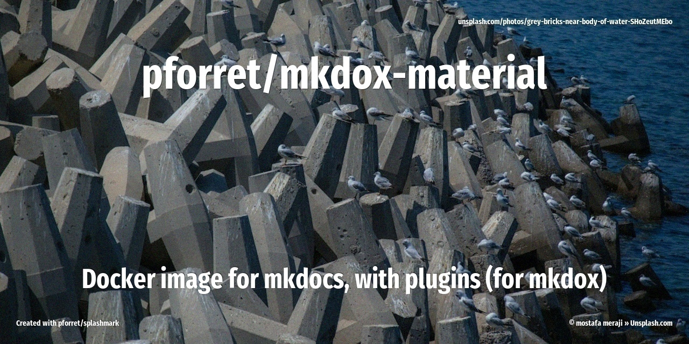

# Mkdox Material Docker Image

## Extra plugins
* [lukasgeiter/mkdocs-awesome-pages-plugin](https://github.com/lukasgeiter/mkdocs-awesome-pages-plugin)

## Metadata
* On Docker Hub: [pforret/mkdox-material](https://hub.docker.com/repository/docker/pforret/mkdox-material)
* Used by [pforret/mkdox](https://github.com/pforret/mkdox)
